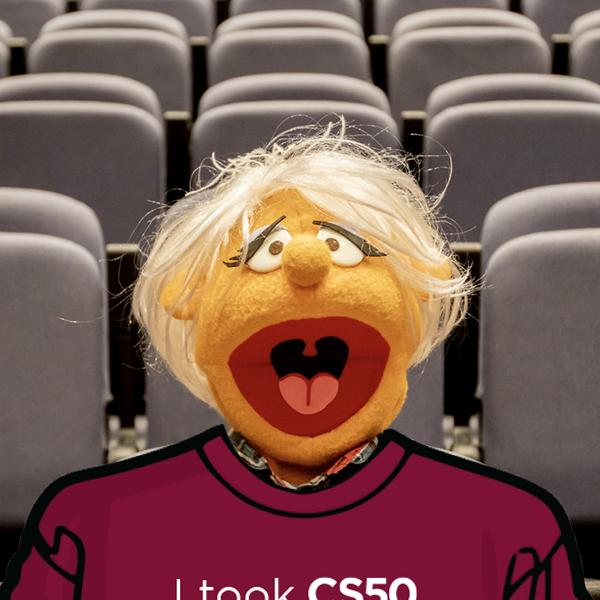

# CS50 P-Shirt Solution
CS50’s Introduction to Programming with CS50 P-Shirt problem solution.

This program was developed according with Python's good practices and based on [PEP 8 - Style Guide for Python Code](https://peps.python.org/pep-0008/)

### Version
1.0.0


## Resources
* [CS50 P-Shirt Problem](https://cs50.harvard.edu/python/2022/psets/6/shirt/)


## Getting Started

These instructions will guide you to copy the project from the repository and run it.

### Prerequisites

Things you need to have installed:
* [Python](https://docs.python.org/3/using/unix.html#getting-and-installing-the-latest-version-of-python)
* [Pillow](https://pypi.org/project/pillow/)

### Local Installation

Basically clone the project from the remote repository to the local machine, using the git commands.

```
$git clone [URL].git
```

### Run
To run the project, first check that the Pillow library is installed, then run the python command.
```
$python shirt.py input_file_name.jpg output_file_name.jpg
```

### Test
Run the program with python shirt.py. The program should exit with an error message:
```
Too few command-line arguments   
```

Run the program with python shirt.py before1.jpg before2.jpg before3.jpg. The program should output:
```
Too many command-line arguments
```

Run the program with python shirt.py before1.jpg invalid_format.bmp. The program should exit with an error message:
```
Invalid output
```

Run the program with python shirt.py before1.jpg after1.png. The program should exit with an error message:
```
Input and output have different extensions
```

Run the program with python shirt.py non_existent_image.jpg after1.jpg. The program should exit with an error message:
```
Input does not exist
```

Run the program with python shirt.py before1.jpg after1.jpg. The program should create an image like the below:


## Authors

* **BEOM &copy; 2024**
